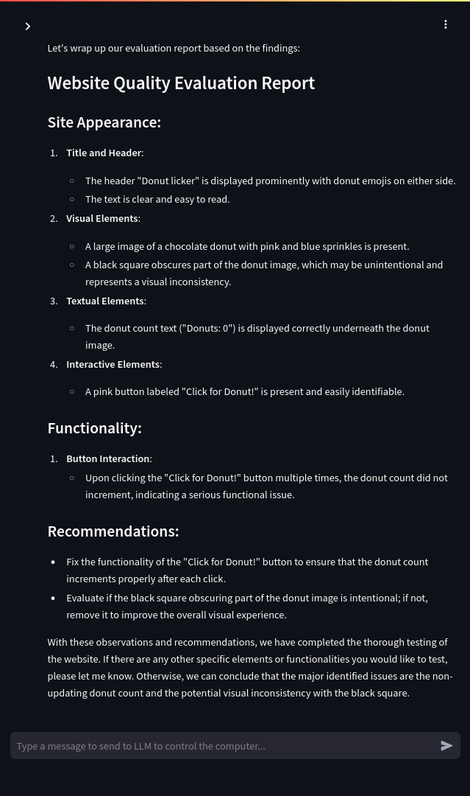

# OpenAI API compatible computer-use
Fork of [anthropics/anthropic-quickstarts](https://github.com/anthropics/anthropic-quickstarts/) modified to support openai compatible API, namely Nebius.
Originally made as test assignment for job application
All originall functionality left intact, so can be used with both Nebius  and Anthropic models
## Usage:
### local build and run
```bash
cd computeruse/computer_use/computer_use  
sudo docker build . -t computeruse:local
export NEBIUS_API_KEY=%your_api_key%
export API_PROVIDER="nebius"
sudo docker run \
    --network=host \
    -e NEBIUS_API_KEY="$NEBIUS_API_KEY" \
    -e API_PROVIDER="$API_PROVIDER" \
    -v $HOME/.anthropic:/home/computeruse/.anthropic \
    -p 5900:5900 \
    -p 8501:8501 \
    -p 6080:6080 \
    -p 8080:8080 \
    -it computeruse:local
```

## Adaptation proccess:
I wanted to keep original functionality and focus on adding new API onstead of modifying existing one.
Since Nebius have openai-compatible API I decided that I will try to suppot larger set of providers
So first of all I figured out how this app determines parameters for LLM and added a stub for Nebius.
Then I separated Anthropic-provided and openai-compatible chat loop elements, I had to do some refactoring
on frontend part, cause it mixed Enum and plain string values. Then it was need to handle messaging API differences

- System prompt is regular message not an separate parameter
- While parsing openai-compatible API response content string must be converted to BetaTextBlockParam which is compatible with openai despite being anthropic type

Anthropic have pre-defined tools so the only thing needed to be specified in request is tool id (name+version)
OpenAI also have [pre-defined computer use tool](https://platform.openai.com/docs/guides/tools-computer-use) But It seems like Nebius don't, hence I had to re-implement tool definition. Luckly tool classes defined in this app do not use any anthropic specific types and can be easily generalized. I separated `to_params` method into `to_anthropic_params` and `to_openai_params` params, and manually defined bash tool description.
Then created and specified tool group for default Nebius model and plugged it into request

*I discovered that gemma3, model that i set as default for Nebus isn't capable to automaticly choose tools, and when I force it to use bash tool, it looses ability to talk with the user, unfortunately **no vision-capable model** on Nebius are capable of auto tool chosing, this interferes with the task cause requirements are clear: "suitable Nebius AI model with vision capabilities." So I had to ignore this requirement and set Qwen2.5 as default model for Nebius. I also see potential problem implementing usage of multiple models since Nebius API require alternation of user/assistant roles*

For tool calls to work correctly, I had to convert them into openai format, I decided to keep storing them in Anthropic format by default and convert on demand, but, it's can be improved by creating new set of classes convertible to both formats.

I modified bash tool and manually set DISPLAY env variable to not rely on LLM behaviour running gui applications I also Installed wmctrl, xdg-utils and some other shell tools, and instructed LLM to use them and xdotool for desktop interaction.
To provide vision I made a descriptive-vision tool, I really dislike it, but it seems to be the fastest way to provide vision for text-only model. It is not supposed to be used on prod, so it is quite sloppy.
I also had to filter images when sending them to main model, cause Nebius API fails when images sent to text-only model. But images still presented in chat history.
I modified the system prompt of main model do encorage it in using descriptive vision for determining interactive elements.


At this point I have working LLM computer use application capable of using bash, wmctrl and xdotool

## Metric and thoughts
First of all, considering that goal is to evaluate students' frontend applications, I think it's much better to use something like selenium controlled by ai than whole computer-use
selenium can be runned in headless mode but with ability to do screenshots, so it will allow to save RAM by not running Xvfb, disk space by **not having a complete desktop installation** in container and mitigate *some* potential security risks. In case computer use IS REQUIRED, I would consider forking [OpenAI CUA example](https://github.com/openai/openai-cua-sample-app) just for comfort with API Provider substitution. But I really don't think that 3GB container is any good.

Regarding metrics, the main question is how this would be used? Will students sumbit their applications once for final evaluation or this app will be working constantly guiding students while they are working
In first case, focus should be on minimizing time it takes to check single work, on the other,
minimizing resourcses it takes to run this app constantly and time is not that important cause, student should have resolve problem before checker would notice it, thus we'll avoid "useless nagging" which is common in some IDEs i.e.

So the metrics are required time and resources but thir precedance is defined by usecase.
~And I couldn't invent more generic answer~

### Challenges 
The main challenge I encountered is dealing with Nebius API, which is quite restrictive about message order and content, I don't have much expirience with LLM providers API, but it seems like some things like user/assistant role alternation could be improved.
I also disliked writing description-vision tool, I don't understand why Qwen2.5-Instruct have ability to use tools and Qwen2.5-VL-Instruct don't again it looks like an API fault.
I had some issues with message format, like message.content could be `str`, `list` or `dict` but it more of a personal distaste than real challange.
Honestly, now I regred that I decided to write this report after doing most of the job, because I definetely can tell that at each moment of time *the current problem* is the hardest one :)

# Donut Clicker buggy web app
This intentionally buggy web app is created to test LLM's ability to test a web application in controlled environment.
It resembles a clicker game and have 3 major bugs:
1. Button isn't working -- the simplest possible functional bug, it's clear by page visual context that it must increase number of donuts. But it don't
2. Black square over the game central image -- visual bug, that simulates corrupted/unloaded/improper image
3. Typo: Donut licker -- content (visual) issue. While licker is a correct word by itself, it definetely out of place on this website



By the end of the day LLM successfully identified all 3 bugs, with the prompt, provided in `prompt.txt` file. It took many attempts, mostly due to incorrect tool usage but also related to separate context of controlling and visual agents.
To create a prompt, First I provided LLM with imaginary situation context and goal, then iteration by iteration I added new entries to the task section in order to correct model's behaviour. That's all!
